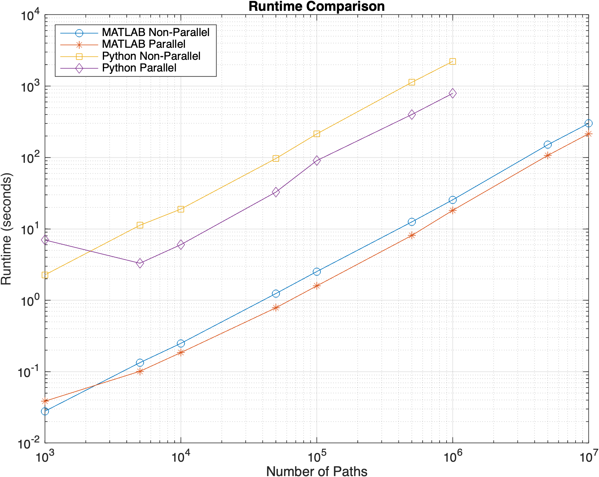
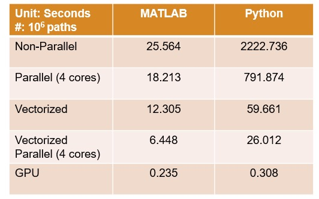

# Parallel Computing Applications in Finance: Monte Carlo Simulations for Option Pricing

## Overview
This repository demonstrates the application of Monte Carlo simulations in finance for estimating the price of a European call option. The project highlights the use of parallel computing to accelerate simulation processes, comparing the performance and computational efficiency of MATLAB and Python implementations.

### Table of Contents
1. [Project Background and Key Features](#project-background-and-key-features)
2. [Project Structure](#project-structure)
3. [Requirements](#requirements)
4. [Usage](#usage)
5. [Results and Conclusion](#results-and-conclusion)
6. [Resources](#resources)
7. [License](#license)
8. [Acknowledgements](#acknowledgements)
9. [Contact Information](#contact-information)

## Project Background and Key Features
Monte Carlo simulation is a widely used computational algorithm in finance for modeling asset price behavior and estimating the value of financial derivatives, such as options. This project employs Monte Carlo simulation to estimate the price of a European call option by simulating multiple paths for the underlying asset price. The results are then compared with the theoretical price derived from the Black-Scholes formula.

### Key Features
- **Black-Scholes Formula:** The theoretical price of a European call option is calculated using the Black-Scholes formula, and the results are compared with the Monte Carlo estimated price to evaluate accuracy.
- **Monte Carlo Simulation:** A numerical method used for option pricing, which approximates the value of an option by simulating multiple possible future paths of the underlying asset's price.
- **Parallel Computing:** Implementations in both MATLAB and Python leverage parallel computing to improve the computational efficiency of the Monte Carlo simulations.
- **Comparative Analysis:** The repository includes a comparative analysis of the runtime and accuracy between MATLAB and Python implementations, both in parallel and non-parallel configurations.


## Project Structure 
The project is centered around the following key files:
- `OptionPricing_FinalReview.mlx`: MATLAB live script for running the Monte Carlo simulations and comparing the results with the Black-Scholes formula.
- `monte_carlo_multiprocessing.py`: Python script for running the Monte Carlo simulations using multiprocessing.
- `MATLAB_Results.mat`: Pre-computed MATLAB results from the Monte Carlo simulations.
- `Python_Results.mat`: Pre-computed Python results from the Monte Carlo simulations.


## Requirements
- **MATLAB**: R2024a or later with Parallel Computing Toolbox.
- **Python**: Version 3.9 to 3.11 with NumPy, SciPy, Joblib, Pandas, Multiprocessing
, and Pathos.
- **Compatibility**: Ensure Python version is compatible with MATLAB release. See [MATLAB Python Compatibility Guide](https://www.mathworks.com/support/requirements/python-compatibility.html).


## Usage

### 1. Clone the repository:
   ```bash
   git clone https://github.com/yourusername/monte-carlo-option-pricing.git
   cd monte-carlo-option-pricing
   ```

### 2. Ensure all files are in the same directory:
When running the scripts, ensure that all relevant files (`OptionPricing_FinalReview.mlx`, `MATLAB_Results.mat`, `Python_Results.mat`, etc.) are in the same directory. You can use the `pwd` command in MATLAB to confirm this.

### 3. MATLAB Usage:
#### Option 1: Use Pre-Computed Results:
1. Open the `OptionPricing_FinalReview.mlx` script in MATLAB.
2. Set the `doComputing` flags to `false` within the script to load and display the pre-computed results stored in `MATLAB_Results.mat` and `Python_Results.mat`.
3. Run the script to view the results and runtime comparison plots.
#### Option 2: Re-run the Simulations:
1. Set the `doComputing` flags to `true` within the script to run the simulations from scratch.
2. Run the script to perform the Monte Carlo simulations and compare the results against the theoretical prices calculated using the Black-Scholes formula.

### 4. Python Usage:
#### Option 1: Use Pre-Computed Results:
1. Ensure you have Python version 3.9 to 3.11 installed on your machine.
2. Open the `monte_carlo_multiprocessing.py` script in your preferred IDE or text editor.
3. Set the `doComputingPython` flag to `False` to load and display the pre-computed results stored in `Python_Results.mat`.
#### Option 2: Re-run the Simulations:
1. Ensure you have Python version 3.9 to 3.11 installed on your machine.
2. Set the `doComputingPython` flag to `True` to perform the simulations from scratch.
3. Run the script to perform the Monte Carlo simulations.


## Results and Conclusion
This project demonstrates the effectiveness of Monte Carlo simulations for option pricing and the significant performance gains achievable through parallel computing. MATLAB's optimized numerical libraries and parallel processing capabilities make it a preferred choice for complex financial modeling tasks, though Python remains a flexible alternative.
### Runtime Comparison
Below is a runtime comparison between MATLAB and Python implementations in both parallel and non-parallel configurations:

### High Performance and GPU Computing
To improve computing performance, we implemented a vectorized version of the Monte Carlo simulations and leveraged GPU acceleration on an AWS g5 instance with an NVIDIA A10G GPU (72 streaming processors, 24 GB memory), using PyTorch 2.4 and PyTorch-CUDA 12.1 at default double precision.
Below is the runtime comparison between MATLAB (CPU), Python (CPU), and Python (GPU) implementations:



## Resources
- [MATLAB Parallel Computing Toolbox](https://www.mathworks.com/products/parallel-computing.html)
- [What Is Monte Carlo Simulation?](https://en.wikipedia.org/wiki/Monte_Carlo_method)
- [Black-Scholes Model](https://en.wikipedia.org/wiki/Black%E2%80%93Scholes_model)
- [Reduce Time to Results with MATLAB Using Parallel Computing](https://www.mathworks.com/videos/reduce-time-to-results-with-matlab-using-parallel-computing-1691992378869.html?s_tid=srchtitle_site_search_1_Parallel_Time)
- [Python Multiprocessing](https://docs.python.org/3/library/multiprocessing.html)


## License
This project is licensed under the MIT License - see the [LICENSE](LICENSE) file for details.


## Acknowledgements
This project was a collaborative effort between Columbia University and MathWorks. We are immensely grateful to the following individuals for their invaluable contributions and unwavering support:
- **[Yuchen Dong](https://www.linkedin.com/in/yuchen-dong-48061582/)** - for providing comprehensive technical guidance and mentorship. Yuchen played a crucial role in facilitating communication across the team and supporting all aspects of the project’s development. We deeply appreciate the journey we’ve shared and the progress we’ve made together under his guidance.
- **[Weinan Chen](https://www.linkedin.com/in/weinan-chen-30bb3b50/)** - for offering insightful reviews and suggestions that greatly contributed to refining the project and ensuring its overall quality.
- **[Michael Robbins](https://www.linkedin.com/in/michaelrobbins/)** - for his additional mentorship and continuous support, which were instrumental in the successful completion of this project.

We also extend our appreciation to the open-source community and the developers of the tools and libraries used in this project.

## Contact Information
For any questions, suggestions, or collaboration inquiries, feel free to reach out via email or LinkedIn:
- **Jue Liu** - [jl6649@columbia.edu](mailto:jl6649@columbia.edu) | [LinkedIn](https://www.linkedin.com/in/jue-l/)
- **Lixue Cheng** - [lc3813@columbia.edu](mailto:lc3813@columbia.edu) | [LinkedIn](https://www.linkedin.com/in/charlottecheng0501/)
